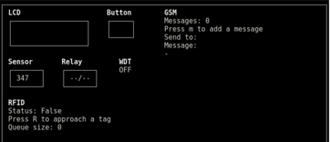

# Ardupysimq: Transparent Arduino simulator (C++/Python)

  

Compile and execute your Arduino C/C++ sketches on a standard desktop build environment and visualize/interact with the inputs/outputs (analog, digital, serial, filesystem) in a graphical terminal interface powered by Python.  

Only minimal changes on the C++ code are required (a Makefile and the inclusion of a library). The communication between the simulator and the Arduino code is handled transparently using [zeromq](http://zeromq.org/). 



- **Supported functions**: Serial communication, SD filesystem read/write, digital and analog read/write, Tones (PWM), Watchdog timers.
- **Specific modules**: Serial LCD, Button (digital input), Relay (digital output), Sensor (analog input), Buzzer (analog output).

## Usage

### Adapt and compile  your Arduino C++ code

Include the `ArduinoSim.h` header file, plus those of the modules you would like to use:

```c++
#include <ArduinoSim.h>
// Optional:
#include <SDSim.h>
#include <LCD.h>
#include <Buzzer.h>
#include <Button.h>
#include <Relay.h>
#include <ParallaxRFID.h>
#include <MFRC522RFID.h>
```
By passing the flag `SIMULATOR`and linking the library `ArduinoSim` (plus those of the modules you would like to use), you can now compile your Arduino sketch on your desktop. Moreover, the code can still be compiled for Arduino.  

For example, using the example [Makefile](cpp/Makefile), the command `make arduino` will compile for the Arduino platform (with [ino](http://inotool.org/)), while `make simulator` will compile for a standard Linux build environment.

### Edit and launch the simulator

Edit the Python script [minimal_example.py](python/minimal-example.py) to define the modules used and the simulator interface. A complete example can be found in [minimal_example.py](python/example.py)

Launch the simulator with (sudo is required so that zmq can bind a socket):

```bash
$ sudo python -m main
```
### Launch the Arduino sketch

```bash
$ ./simulator
```

You should now be able to visualize and interact with inputs and outputs on the simulator.

## Implementing new modules
